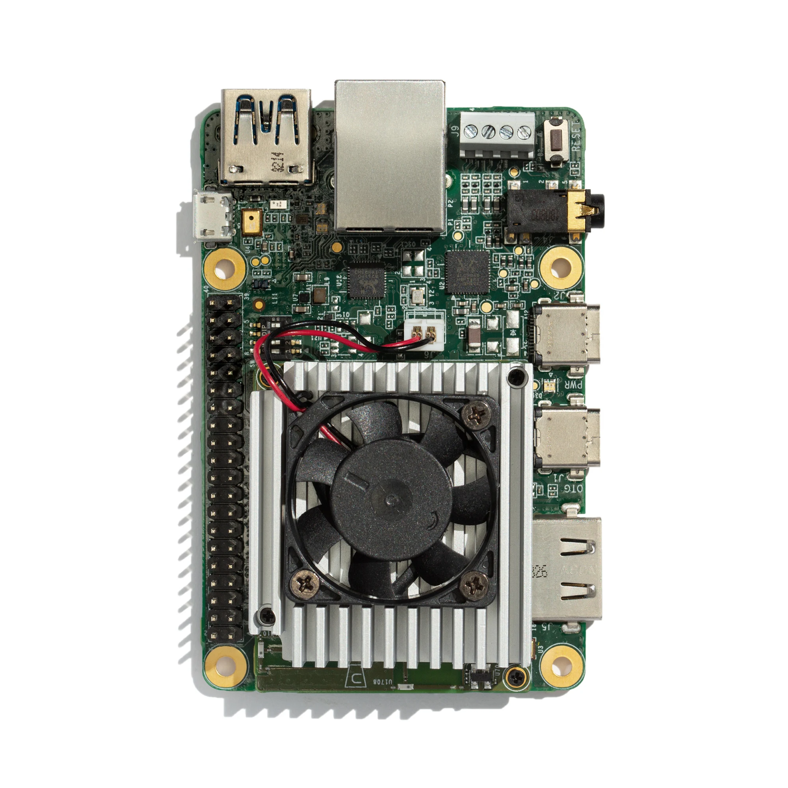

# Converting to TF Lite

### Setup

```text
import tensorflow as tf
from tensorflow import keras
```

### Converting and saving

The model defined with Functional or Sequential API may be easily converted to TF Lite:

```text
inputs = keras.Input(shape=(1, 4))
x = keras.layers.Dense(8, activation=tf.nn.sigmoid, input_dim=1, name="dense_1")(inputs)
outputs = keras.layers.Dense(1, name="output_layer")(x)
model = tf.keras.Model(inputs, outputs, name="My_Model")
print(model.summary())

# model = keras.Sequential()
# model.add(keras.Input(shape=(1,4)))
# model.add(keras.layers.Dense(8, activation=tf.nn.sigmoid, name="dense_1"))
# model.add(keras.layers.Dense(1, name="output_layer"))
# print(model.summary())

converter = tf.lite.TFLiteConverter.from_keras_model(model)
tf_lite_model = converter.convert()
```

and stored for further deployment

```text
with open('./saved/keras/tflite/model.tflite', 'wb') as f:
    f.write(tf_lite_model)
```

### TF Lite devices

It's worth seeing on some special-designed devices that optimized for TF Lite runtime. One type of them is manufactured by Coral AI with Google-supplied Edge TPU. 



See [**here**](https://coral.ai/products/#prototyping-products) ****for more**.**

